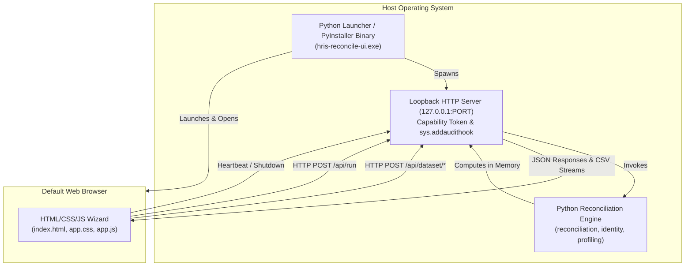
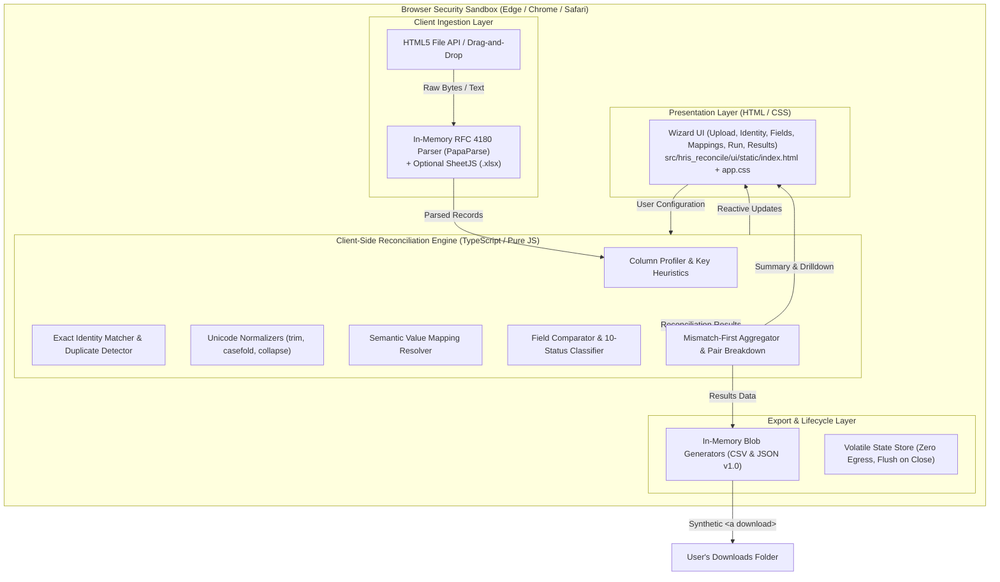
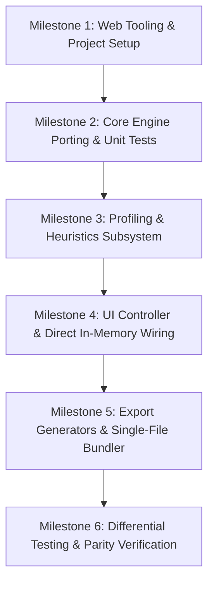

# Implementation Plan: In-Browser HTML Version of HRIS Reconciliation

## 1. Executive Summary & Strategic Rationale

### 1.1 Context
In release v0.3, `hris-reconcile` transitioned from Streamlit to a lightweight, zero-dependency Python loopback server (`server.py`) coupled with a vanilla JavaScript/HTML/CSS wizard frontend (`src/hris_reconcile/ui/static/`). This architecture successfully achieved:
1. Complete elimination of heavy data frameworks (`pandas`, `streamlit`, `tornado`, `altair`).
2. Private in-memory processing where data is held strictly in volatile RAM.
3. Rapid deterministic reconciliation, profiling, and mismatch diagnosis.

However, packaging this Python backend into distributable native desktop executables (via PyInstaller as defined in [`hris-reconcile-ui.spec`](file:///Users/michaelstaggenborg/Documents/Code/hris-reconcile/hris-reconcile-ui.spec) and [`docs/windows_release.md`](file:///Users/michaelstaggenborg/Documents/Code/hris-reconcile/docs/windows_release.md)) creates significant operational friction in corporate environments:
- **Endpoint Protection (EDR/AV)**: Unpacking runtimes into `%TEMP%/_MEIxxxx` triggers behavioral heuristics in Defender, CrowdStrike, and Carbon Black.
- **Code Signing & Trust**: Windows SmartScreen blocks unsigned binaries, while macOS Gatekeeper refuses ad-hoc signed `.app` bundles without Apple Developer notarization.
- **Cross-Platform Compilation**: PyInstaller cannot cross-compile Windows executables from macOS/Linux, necessitating dedicated Windows build runners and continuous maintenance.

### 1.2 The In-Browser HTML Solution
The core reconciliation engine is **pure, deterministic computation over tabular data**:
- It reads CSV/Excel files into memory.
- It indexes keys, checks duplicates, applies string normalizations, resolves value mappings, and computes field discrepancies.
- It calculates summary metrics, aggregations, and drill-downs.

Modern web browsers (Microsoft Edge, Google Chrome, Mozilla Firefox, Apple Safari) provide a secure, high-performance, sandboxed JavaScript runtime. By porting the domain logic from Python to TypeScript/JavaScript and running it **100% client-side in the user's browser**, we achieve:
1. **Zero Installation / Instant Execution**: Analysts double-click a single standalone `.html` file (`hris-reconcile.html`) or open an internal intranet URL.
2. **Absolute Privacy Guarantee**: **0 bytes leave the browser tab**. No external network requests, no local server listening on ports, no persistent disk writes. When the browser tab is closed, all payroll and HR data is immediately wiped from memory.
3. **No IT Barriers**: Completely bypasses AppLocker, SmartScreen, Gatekeeper, and code-signing infrastructure.
4. **Universal Compatibility**: Identical behavior on Windows 10/11, macOS, and Linux without platform-specific builds.

---

## 2. Architecture Comparison

### 2.1 Current Architecture (v0.3 Python Desktop / Loopback Server)



### 2.2 Target Architecture (v1.0 Pure In-Browser Client-Side Application)



### 2.3 Complexity Eliminated
| Eliminated Architectural Layer | Benefits Realized |
| :--- | :--- |
| **PyInstaller Packaging** | No `.spec` files, no bootloaders, no cross-compilation matrix, no 27 MB `.app` / 30 MB `.exe` binaries. |
| **Local Listening Sockets** | No port allocation collisions, no binding to `127.0.0.1`, no multi-user Citrix/VDI cross-talk risks. |
| **Security Tripwires & Tokens** | No `sys.addaudithook`, no ephemeral bearer tokens, no Origin/Host verification headers required. |
| **Heartbeat & Process Lifecycle** | No 5-second polling timers, no 90-second timeout watchdogs, no `pagehide` beacon handling. |
| **OS Code Signing** | No Windows Authenticode EV certificates, no Apple Developer notarization tickets. |

---

## 3. Subsystem Porting & Algorithmic Parity Matrix

Every domain component in Python has an exact 1:1 algorithmic counterpart in TypeScript/JavaScript to ensure deterministic parity.

### 3.1 Dataset Ingestion & Validation
*Python: [`src/hris_reconcile/adapters/csv_adapter.py`](file:///Users/michaelstaggenborg/Documents/Code/hris-reconcile/src/hris_reconcile/adapters/csv_adapter.py), [`src/hris_reconcile/ui/csv_upload.py`](file:///Users/michaelstaggenborg/Documents/Code/hris-reconcile/src/hris_reconcile/ui/csv_upload.py)*

- **Encoding**: UTF-8 with automatic BOM (`\uFEFF`) stripping via `TextDecoder("utf-8")` or FileReader.
- **Delimiter Sniffing**: Inspect the first 8 KB to detect `,`, `;`, `\t`, or `|`.
- **Validation Rules**:
  - Empty dataset error if 0 records.
  - Missing header error.
  - Empty column name error if any header token is `""`.
  - Duplicate column names error (e.g. `['id', 'name', 'id']`).
  - Ragged row validation: `row.length === header.length`, reporting the exact 1-indexed row number.
- **Representation**: Dataset object `{ name: string, columns: string[], records: Record<string, string | null>[] }`. Empty strings convert strictly to `null`.
- **Excel Enhancement (Future/v1.1)**: Add SheetJS (`xlsx.mini.js`) to support direct `.xlsx` / `.xls` drag-and-drop.

### 3.2 Dataset Profiling
*Python: [`src/hris_reconcile/ui/profiling.py`](file:///Users/michaelstaggenborg/Documents/Code/hris-reconcile/src/hris_reconcile/ui/profiling.py)*

For every column in the dataset:
- `row_count`: Total record count.
- `non_null_count`: Count where `value !== null`.
- `null_percentage`: `round((row_count - non_null_count) / row_count * 100, 2)`.
- `distinct_count`: Count of unique non-null values.
- `uniqueness_percentage`: `round(distinct_count / non_null_count * 100, 2)` (or 0.0 if empty).
- `sample_values`: First 5 distinct non-null values encountered in insertion order.

### 3.3 Heuristics & Smart Suggestions
*Python: [`src/hris_reconcile/ui/suggestions.py`](file:///Users/michaelstaggenborg/Documents/Code/hris-reconcile/src/hris_reconcile/ui/suggestions.py)*

#### Header Normalization & Similarity
- Header parsing: Insert spaces before PascalCase/camelCase transitions (`(?<=[a-z0-9])(?=[A-Z])`), lowercase, split on non-alphanumeric `[^a-z0-9]+`.
- Similarity score: Max of:
  1. `SequenceMatcher.ratio` (Gestalt pattern matching or Levenshtein character similarity).
  2. Jaccard token overlap: `|tokensA ∩ tokensB| / |tokensA ∪ tokensB|`.
  3. Domain alias lookup table:
     - `firstname` ↔ `givenname` (0.92)
     - `lastname` ↔ `surname` (0.92)
     - `standardhours` ↔ `weeklyhours` (0.90)
     - `personid` ↔ `employeenumber` (0.88)
     - `company` ↔ `companycode` (0.85)

#### Identity Candidate Scoring
Formula:
$$\text{Score} = 0.20 \cdot \text{header} + 0.15 \cdot \min(\text{pop}_L, \text{pop}_R) + 0.20 \cdot \text{uniqueness} + 0.35 \cdot \text{overlap} + 0.10 \cdot \text{affinity}$$
- Identifier affinity = 1.0 if tokens contain `id`, `identifier`, `key`, `number`, or string ends with `id` or contains `personnelnumber`.
- `confident = score >= 0.72 && overlap >= 0.50 && uniqueness >= 0.80`.

#### Field Mapping Suggestions
- Filter out selected identity columns.
- Pair candidate columns by similarity score (`>= 0.65`).
- Greedy matching: Assign highest-scoring pairs first, ensuring each column is mapped at most once.

### 3.4 Identity Resolution
*Python: [`src/hris_reconcile/identity/resolver.py`](file:///Users/michaelstaggenborg/Documents/Code/hris-reconcile/src/hris_reconcile/identity/resolver.py)*

- Build index `Map<string, Record[]>` for Left and Right datasets.
- Throw an error if any identity value is `null` or `""`.
- Union and sort all identities (`Array.from(new Set([...leftKeys, ...rightKeys])).sort()`).
- Categorize each identity:
  - `DUPLICATE_LEFT`: `leftRecords.length > 1`
  - `DUPLICATE_RIGHT`: `rightRecords.length > 1`
  - `MISSING_LEFT`: Present only in Right dataset.
  - `MISSING_RIGHT`: Present only in Left dataset.
  - `MATCHED`: Exactly 1 record on Left and 1 record on Right.

### 3.5 Normalization Engine
*Python: [`src/hris_reconcile/normalization/builtins.py`](file:///Users/michaelstaggenborg/Documents/Code/hris-reconcile/src/hris_reconcile/normalization/builtins.py), [`src/hris_reconcile/normalization/registry.py`](file:///Users/michaelstaggenborg/Documents/Code/hris-reconcile/src/hris_reconcile/normalization/registry.py)*

Standard normalizers:
- `trim`: `value.trim()`
- `uppercase`: `value.toUpperCase()`
- `lowercase`: `value.toLowerCase()`
- `casefold`: Full Unicode case-folding (handling special cases like German `ß` -> `ss` matching Python's `str.casefold()`).
- `collapse_whitespace`: `value.replace(/\s+/g, ' ')`
- `Normalized Text` mode applies the canonical chain: `[trim, collapse_whitespace, casefold]`.

### 3.6 Semantic Value Mapping
*Python: [`src/hris_reconcile/mapping/resolver.py`](file:///Users/michaelstaggenborg/Documents/Code/hris-reconcile/src/hris_reconcile/mapping/resolver.py), [`src/hris_reconcile/ui/mapping_analysis.py`](file:///Users/michaelstaggenborg/Documents/Code/hris-reconcile/src/hris_reconcile/ui/mapping_analysis.py)*

#### Observed Pair Analysis
- Across all `MATCHED` identities, extract pairs `(left_val, right_val)`.
- Count occurrences and calculate consistency:
  $$\text{Consistency} = \min\left(\frac{\text{count}}{\text{leftCount}}, \frac{\text{count}}{\text{rightCount}}\right)$$
- Auto-suggest as accepted if: `left_val !== null && right_val !== null && count >= 2 && consistency >= 0.95`.

#### Mapping Resolver
- Invert mapping definition into fast lookup dictionaries:
  - `leftIndex[normalizedValue] -> canonicalValue`
  - `rightIndex[normalizedValue] -> canonicalValue`
- Resolves to: `NULL`, `MAPPED(canonicalValue)`, or `UNMAPPED`.

### 3.7 Field Comparison & Results Classification
*Python: [`src/hris_reconcile/reconciliation/comparator.py`](file:///Users/michaelstaggenborg/Documents/Code/hris-reconcile/src/hris_reconcile/reconciliation/comparator.py), [`src/hris_reconcile/reconciliation/engine.py`](file:///Users/michaelstaggenborg/Documents/Code/hris-reconcile/src/hris_reconcile/reconciliation/engine.py)*

For every comparison field on every matched employee:
1. `BOTH_NULL`: `left_raw === null && right_raw === null`
2. `LEFT_NULL`: `left_raw === null && right_raw !== null`
3. `RIGHT_NULL`: `left_raw !== null && right_raw === null`
4. `MATCH_EXACT`: `left_raw === right_raw`
5. If `mode === "Value mapping"`:
   - Normalize values according to field settings.
   - Lookup canonical representations.
   - `UNMAPPED_LEFT` if left value not in dictionary.
   - `UNMAPPED_RIGHT` if right value not in dictionary.
   - `MATCH_MAPPED` if `left_canonical === right_canonical`.
   - `MISMATCH` otherwise.
6. If `mode === "Normalized text"`:
   - `MATCH_NORMALIZED` if `left_normalized === right_normalized`.
   - `MISMATCH` otherwise.
7. Otherwise (`Exact`): `MISMATCH`.

### 3.8 Result Aggregations & Export
*Python: [`src/hris_reconcile/ui/results_analysis.py`](file:///Users/michaelstaggenborg/Documents/Code/hris-reconcile/src/hris_reconcile/ui/results_analysis.py), [`src/hris_reconcile/reporting/json_report.py`](file:///Users/michaelstaggenborg/Documents/Code/hris-reconcile/src/hris_reconcile/reporting/json_report.py)*

- **Metrics Counter**: Matched employees, missing left/right, duplicate identities, field matches, field discrepancies, unmapped values.
- **Mismatch by Field**: Aggregates discrepancy count, total comparisons, and mismatch rate % sorted descending by mismatch count.
- **Mismatch by Pair**: Aggregates distinct `(left_val, right_val, status)` combinations with employee counts and share %.
- **Drill-Down**: Filterable list of discrepancy records with identity, field name, left/right values, and status.
- **Downloads (Pure Client-Side Blobs)**:
  - `full.csv`: RFC 4180 export of all identity and field results.
  - `mismatches.csv`: Filtered export containing only identity mismatches/duplicates and field discrepancies.
  - `report.json`: Formatted JSON adhering strictly to `ReconciliationReport` v1.0 schema with metadata (`processing_mode: "browser"`).

---

## 4. UI/UX Architecture & Enhancements

The existing wizard layout in [`src/hris_reconcile/ui/static/index.html`](file:///Users/michaelstaggenborg/Documents/Code/hris-reconcile/src/hris_reconcile/ui/static/index.html) and [`app.css`](file:///Users/michaelstaggenborg/Documents/Code/hris-reconcile/src/hris_reconcile/ui/static/app.css) is preserved and improved:

```
+-----------------------------------------------------------------------------------+
| [Private In-Browser Workbench]  HRIS Reconciliation                               |
| Discover why two HR datasets disagree.      [Clear Session]  [Close Window]       |
+-----------------------------------------------------------------------------------+
|  (i) 100% Client-Side In-Browser. No data leaves this device. 0 bytes network egress. |
+-----------------------------------------------------------------------------------+
| [Step 1: Upload Datasets]                                                         |
|   +------------------------------------+   +------------------------------------+ |
|   | Dataset A                          |   | Dataset B                          | |
|   | [ Drag & Drop CSV or Choose File ] |   | [ Drag & Drop CSV or Choose File ] | |
|   | 1,240 rows * 14 columns            |   | 1,215 rows * 12 columns            | |
|   +------------------------------------+   +------------------------------------+ |
+-----------------------------------------------------------------------------------+
| [Step 2: Match Employees (Identity)]                                              |
|   Suggested: person_id <-> employee_number (98.2% overlap)                        |
|   [ Confirm Employee Identity ]                                                   |
+-----------------------------------------------------------------------------------+
| [Step 3: Match Fields]                                                            |
|   first_name <-> given_name  [ Normalized text v ]                                |
|   company    <-> comp_code   [ Value mapping   v ]                                |
|   [ Add Row ] [ Confirm Field Mappings ]                                          |
+-----------------------------------------------------------------------------------+
| [Step 4: Review Value Mappings]                                                   |
|   [x] CANONICAL_001 | DE01 <-> 1000 | 450 employees (100%) [ High Confidence ]   |
|   [ Confirm Accepted Semantic Mappings ]                                          |
+-----------------------------------------------------------------------------------+
| [Step 5: Run Comparison]                                                          |
|   Reconciliation Name: [ core_hr_vs_payroll ]                                     |
|   [ Run Reconciliation ]                                                          |
+-----------------------------------------------------------------------------------+
| [Step 6: Explore Discrepancies & Download]                                        |
|   [ 1,200 Matched ] [ 40 Missing Left ] [ 15 Missing Right ] [ 38 Discrepancies ] |
|   Mismatch Analysis Table | Mismatch Pattern Explorer | Employee Drill-down       |
|   [ Download Full CSV ] [ Download Mismatches CSV ] [ Download JSON Report ]       |
+-----------------------------------------------------------------------------------+
```

### 4.1 UI Enhancements
1. **Drag-and-Drop Dropzones**: Add visual drop targets over `#left-card` and `#right-card` with drag-over highlighting, while retaining standard `<input type="file">`.
2. **Instant Feedback & Zero Latency**: Since execution runs in memory, profiling, suggestions, and reconciliation run instantaneously (typically <100ms for 5,000 rows).
3. **Web Worker Offloading (for >20,000 rows)**: Ensure the UI remains 60fps responsive by running heavy parsing and comparison in a background Web Worker if files exceed 10 MB.
4. **Clean Session Reset**: "Clear session / start over" resets all in-memory arrays and DOM elements without requiring a page reload.
5. **No Network Beacon Overhead**: Removed heartbeat timers, loopback auth tokens, and shutdown endpoints.

---

## 5. Delivery Options & Packaging

We provide two distribution formats:

### 5.1 Delivery Option A: Standalone Single-File HTML (`dist/hris-reconcile.html`) *(Recommended)*
A single, self-contained file containing:
- All HTML markup.
- Inlined CSS styles (from `app.css`).
- Inlined, bundled JavaScript (PapaParse + TypeScript reconciliation engine + UI controller).
- **Size**: ~120 KB total (uncompressed).
- **Distribution**: Emailed, stored on a shared network drive (`S:\Payroll\Tools\`), or distributed via SharePoint.
- **User Experience**: Double-click the file; it opens in Microsoft Edge or Google Chrome. No installation, no internet, no administrator rights needed.

### 5.2 Delivery Option B: Static Intranet Web Application
- Deploy the static assets (`index.html`, `app.css`, `app.js`, `vendor.js`) to an internal static web server, corporate SharePoint site, internal GitHub/GitLab Pages, or an AWS S3/Azure Blob static site.
- Analysts access it via bookmark: `https://reconcile.corp.internal/`.
- Updates are rolled out instantly to all users by updating the static web host.

---

## 6. Implementation Plan & Work Breakdown Structure



### Milestone 1: Web Tooling & Project Setup
- [ ] Initialize `package.json` with modern, lightweight web development tooling.
- [ ] Configure TypeScript (`tsconfig.json`) in strict mode.
- [ ] Configure Vitest for fast, headless unit testing of domain logic.
- [ ] Install production dependencies: `papaparse` (RFC 4180 CSV parser) and `@types/papaparse`.
- [ ] Configure bundler (e.g. Vite with `vite-plugin-singlefile`, or a bespoke Python/Node inlining script) to generate `dist/hris-reconcile.html`.

### Milestone 2: Core Engine Porting & Unit Tests
Port core domain models and logic into `src/web/core/`:
- [ ] **Data Types & Models** (`types.ts`):
  - `Dataset`, `Record`, `IdentityResult`, `IdentityStatus`, `FieldComparisonResult`, `FieldComparisonStatus`, `ComparisonMode`.
- [ ] **String Normalization** (`normalization.ts`):
  - `trim`, `uppercase`, `lowercase`, `casefold`, `collapseWhitespace`, and `NormalizerRegistry`.
  - Comprehensive Unicode test cases matching Python behavior.
- [ ] **Identity Resolver** (`identity.ts`):
  - Exact key indexing, duplicate detection, left/right unmatched classification.
- [ ] **Mapping Resolver** (`mapping.ts`):
  - Bidirectional lookup for left and right values to canonical values.
- [ ] **Field Comparator & Engine** (`reconciliation.ts`):
  - `compareField` and `ReconciliationEngine` supporting all 10 comparison statuses.
- [ ] **Unit Tests**: Implement 100% equivalent test coverage matching `test_identity.py`, `test_normalization.py`, `test_mapping.py`, and `test_comparator.py`.

### Milestone 3: Profiling, Heuristics & Suggestions
Port UI analytical helpers into `src/web/analysis/`:
- [ ] **CSV Parsing & Validation** (`csv.ts`):
  - Ingest `ArrayBuffer` or `File` with PapaParse, enforce duplicate column checks, ragged row validation, and empty string -> `null` conversion.
- [ ] **Dataset Profiler** (`profiling.ts`):
  - Compute row count, null percentages, distinct counts, uniqueness percentages, and samples.
- [ ] **Heuristics & Suggestion Engine** (`suggestions.ts`):
  - PascalCase/camelCase tokenization.
  - Character similarity (Levenshtein / SequenceMatcher equivalent) and token overlap.
  - Identity scoring formula with exact weights and thresholds.
  - Field suggestion greedy assignment.
- [ ] **Observed Pair Analysis** (`mapping_analysis.ts`):
  - Cross-tabulation, consistency percentages, auto-suggestion threshold.
- [ ] **Unit Tests**: Test against same fixture data as `test_profiling.py`, `test_suggestions.py`, and `test_mapping_analysis.py`.

### Milestone 4: UI Controller & Direct In-Memory Wiring
Refactor [`app.js`](file:///Users/michaelstaggenborg/Documents/Code/hris-reconcile/src/hris_reconcile/ui/static/app.js) to call client-side engine directly:
- [ ] Remove `request()`, `jsonRequest()`, capability token parsing, and `fetch()` network calls.
- [ ] Replace asynchronous API boundaries with direct, typed calls to the in-memory engine.
- [ ] Update dataset upload handlers:
  - Support drag-and-drop file drop onto dataset cards.
  - Immediate client-side parsing and profile generation.
- [ ] Wire Step 2 (Identity), Step 3 (Fields), Step 4 (Mappings), and Step 5 (Run):
  - Maintain exact wizard state transition rules.
- [ ] Wire Step 6 (Results):
  - Metrics cards, field mismatch summary table, mismatch pair dropdown, employee drill-down table.
- [ ] Update "Clear session / start over":
  - Flush all state objects and reset wizard to Step 1.
- [ ] Update "Quit":
  - Change to `window.close()` or display a clean "Session cleared and closed" screen.

### Milestone 5: Export Generators & Single-File Bundler
- [ ] **Client-Side Export Generators** (`export.ts`):
  - `generateReconciliationCsv(result, { mismatchesOnly })`: Generate RFC 4180 CSV with proper escaping.
  - `generateReconciliationJson(contract, result)`: Generate formatted JSON conforming to `ReconciliationReport` v1.0.
  - Trigger downloads using `URL.createObjectURL(blob)` and synthetic anchor clicks.
- [ ] **Single-File Bundler**:
  - Create a build script (`npm run build` or `python scripts/bundle_html.py`) that inlines all CSS and JS into `dist/hris-reconcile.html`.
  - Ensure the output file is completely self-contained and operates with zero external network connectivity (air-gapped).

### Milestone 6: Differential Testing & Parity Verification
- [ ] **Golden Master Test Suite**:
  - Run the existing Python CLI on [`examples/core_hr_vs_payroll`](file:///Users/michaelstaggenborg/Documents/Code/hris-reconcile/examples/core_hr_vs_payroll) to generate reference `report.json`, `full.csv`, and `mismatches.csv`.
  - Run the TypeScript engine with identical inputs.
  - Automate assertion that the outputs match bit-for-bit (ignoring formatting timestamps/engine version strings).
- [ ] **Zero-Egress Security Audit**:
  - Automated test verifying that `window.fetch`, `XMLHttpRequest`, `WebSocket`, and `navigator.sendBeacon` are never called during full workflow execution.
- [ ] **Cross-Browser Verification**:
  - Test `dist/hris-reconcile.html` in Microsoft Edge, Google Chrome, Safari, and Firefox.

---

## 7. Differential Testing Matrix

To guarantee 100% computational fidelity between the Python and HTML versions, the test suite must execute differential tests on the following scenarios:

| Test Scenario | Input Data Characteristics | Expected Validation Point |
| :--- | :--- | :--- |
| **Exact Identity & Exact Fields** | Clean IDs, matching casing and whitespace. | Identical match counts, zero mismatches. |
| **Missing Left / Missing Right** | Unbalanced employee rosters. | Identical `MISSING_LEFT` and `MISSING_RIGHT` counts. |
| **Duplicate Keys** | Repeated employee IDs on one or both sides. | Identical `DUPLICATE_LEFT` and `DUPLICATE_RIGHT` classification; records excluded from field comparison. |
| **Normalized Text Matching** | Variations in whitespace, leading/trailing tabs, uppercase/lowercase, German `ß`. | Accurate resolution to `MATCH_NORMALIZED` instead of `MISMATCH`. |
| **Semantic Value Mappings** | Company codes `DE01` ↔ `1000` mapped to `DE_GERMANY`. | Accurate resolution to `MATCH_MAPPED`. |
| **Unmapped Values** | Company codes without assigned canonical value. | Classification as `UNMAPPED_LEFT` / `UNMAPPED_RIGHT` and counted as discrepancies. |
| **Null States** | Empty cells, nulls on left only, right only, or both. | Correct assignment to `BOTH_NULL`, `LEFT_NULL`, `RIGHT_NULL`. |
| **Ragged Rows & Invalid Headers** | CSVs with missing columns, duplicate column names, empty headers. | Graceful user-facing validation errors before reconciliation starts. |

---

## 8. Definition of Done & Acceptance Criteria

1. **Standalone Artifact**: A single file `dist/hris-reconcile.html` exists and opens directly in Edge/Chrome via `file:///` without a web server.
2. **Zero Network Egress**: The application makes 0 HTTP/HTTPS requests during operation; all processing occurs strictly within the browser tab sandbox.
3. **Full Functional Parity**:
   - Both CSV uploads, profiling, and preview tables work.
   - Identity scoring and suggestions match Python heuristics.
   - Field mapping suggestions and modes (`Exact`, `Normalized text`, `Value mapping`, `Ignore`) work identically.
   - Observed pair analysis accurately flags high-confidence semantic mappings.
   - Reconciliation produces identical metrics, mismatch summaries, and employee drill-down results.
   - Full CSV, Mismatches CSV, and JSON report downloads work via browser Blobs.
4. **Automated Test Coverage**: Vitest unit test suite covering 100% of domain logic, passing cleanly.
5. **No Code Compromises**: The existing Python codebase and CLI remain intact and unaffected.
